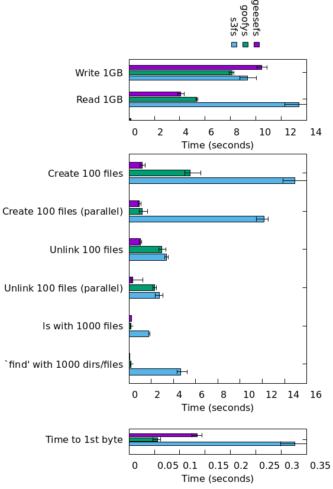

## Simple tests

Test cases:
- Create 6400 files, sized 0.5-300KB, 30KB on average, sharded over 1024 dirs
  with 2 level deep nesting. Similar to copying static files of a small site into S3.
  You can use `gen_small.py` to run this test.
- Delete these 6400 files from S3 (`rm -rf dir`).
- Write 1 10GB file to S3.
- Read 1 10GB file from S3.

| Case       | geesefs  | rclone+cache | rclone     | goofys   | s3fs     |
| ---------- | --------:| ------------:| ----------:| --------:| --------:|
| cp -r 6400 | **0:25** | 6:20         | 7:03       | 8:51     | 53:30    |
| rm -r 6400 | **0:22** | 6:16         | 6:20       | 8:36     | 18:26    |
| read 10G   | 330 MB/s | 56 MB/s      | 63 MB/s    | 530 MB/s | 140 MB/s |
| write 10G  | 420 MB/s | FAIL (HANG)  | FAIL (OOM) | 560 MB/s | 100 MB/s |

All tests were run in a Yandex Cloud VM Instance connecting to Yandex Object Storage.

Don't treat these numbers as a public commitment though :) your mileage may vary
depending on current load of the VM, network and so on.

## mdtest

mdtest is a simple FS metadata operations test: https://github.com/hpc/ior

Note that because of the asynchronous nature of GeeseFS, modified mdtest was used for testing:
https://github.com/vitalif/mdtest - this version issues a directory fsync after each test to
flush all changes to S3.

Results with the same parameters as in JuiceFS tests:
https://github.com/juicedata/juicefs/blob/main/docs/en/mdtest.md

`./mdtest -d ~/ya/mdtest -b 6 -I 8 -z 4`

| Operation          | GeeseFS (64T) | GeeseFS (16T) |  JuiceFS  |     Goofys |
| ------------------ | -------------:| -------------:| ---------:| ----------:|
| Directory creation |   2938.865    |    858.312    |  1536.196 |     25.657 |
| Directory stat     | 107342.263    | 119940.559    |  8244.875 | 141249.883 |
| Directory rename   |     65.307    |     66.512    |  1290.468 |      6.487 |
| Directory removal  |   2233.434    |    607.260    |  1891.828 |     16.449 |
| File creation      |   2503.606    |    889.609    |  1851.515 |     24.670 |
| File stat          | 109301.030    | 108108.010    | 11521.368 |   2231.856 |
| File read          |   7497.517    |   8101.727    |  4891.404 |   3828.739 |
| File removal       |   2069.777    |    614.017    |  1703.411 |     34.494 |
| Tree creation      |   3895.526    |   4363.738    |  1666.822 |     25.022 |
| Tree removal       |   6865.645    |   7338.367    |  1798.640 |     19.224 |

JuiceFS here was using Redis for metadata storage.

The results show that GeeseFS with **just S3** may be faster than JuiceFS with **in-memory**
metadata storage. The only exception is directory rename, for obvious reasons - S3 doesn't have renames.

## Goofys tests

These tests are run with `./run_bench.sh` in this directory. They're rather simple
but the results are also included for completeness:

